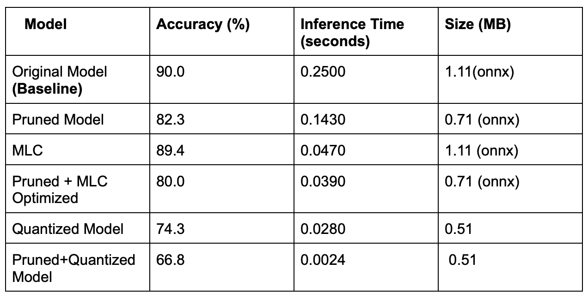

# LPRNetOptimization_RealTimeML-AI

This repository presents a project focused on optimizing the **LPRNet** (License Plate Recognition Network) pretrained model, with the goal of improving its efficiency in real-world deployment. Several optimizations have been made to the existing pretrained model from [here](https://github.com/sirius-ai/LPRNet_Pytorch):

### 1. Model Compilation Optimization by:
- **Apache TVM Autoscheduler** (23 optimizations)

### 2. Model Compression by:
- **Unstructured Pruning**
- **Post Training Quantization**

The optimization strategies applied in this project address critical metrics such as:
- **Inference Time**: Reducing the time it takes for the model to make predictions.
- **Model Size**: Reducing the model size to make it easier to deploy, especially on resource-constrained devices.
- **Accuracy**: Maintaining high accuracy in predictions while improving efficiency.

## Prerequisites

1. Clone this repository:
   ```bash
   git clone https://github.ncsu.edu/ambhansa/LPRNetOptimization_RealTimeML-AI.git
2. Open the directory:
   ```bash
   cd LPRNetOptimization_RealTimeML-AI

## Repository Structure

This repository contains the following components:

### 1. **Notebooks**

The `notebooks` folder contains two primary Jupyter Notebooks. These notebooks are designed for different aspects of model evaluation and optimization. Both notebooks are best executed in Google Colab for seamless execution.

#### **Notebook 1: OriginalModel_ambhansa.ipynb (Pretrained LPRNet Model Testing)**

This notebook is designed to load the original pretrained LPRNet model and evaluate its performance based on various metrics, including accuracy, inference time, and model size. It tests the model in both the full ONNX model size and the ONNX model size with only non-zero parameters.

**To run:**
1. Open the notebook in Google Colab for optimal performance.
2. Clone the LPRNet model and test dataset by executing the cells as highlighted in the notebook.
3. Execute each cell sequentially to obtain metrics such as accuracy, inference time, and model size. The results will be outputted after running the command script.
   
**Metrics Summary:**
- The notebook will display detailed results for both ONNX models and non-zero parameter model sizes.

#### **Notebook 2: FinalProject_Optimizations_ambhansa.ipynb (Model Optimizations)**

This notebook focuses on optimizing the LPRNet model using techniques such as pruning, MLC (Machine Learning Compilation), and quantization. It provides a step-by-step guide, as shown in the table of contents, to test these optimization techniques and includes sections for each method, followed by the optimization summary. The final comparison table contrasts several optimizations and their combinations with respect to the original model.

**To run:**
1. Open the notebook in Google Colab for best performance.
2. Clone the LPRNet model and test dataset by executing the necessary cells.
3. Replace the `load_data.py` file with the version provided in this repository to ensure smooth execution of all optimizations.
4. Execute each cell sequentially as outlined in the notebook and follow the steps to apply pruning, MLC, and quantization techniques.
5. Evaluate the results and compare the performance of each optimized model after each section and at the end of the notebook.

**Table of Contents of Sections in this notebook:**
1. Loading the pretrained model and the test dataset.
2. **Unstructured Pruning**: Selecting the best pruning ratio and observing the impact on model size and performance.
3. **MLC (Machine Learning Compilation)**: Applying autotuning for optimization and evaluating the impact on speed and accuracy.
4. **MLC on Pruned Model**: Combining pruning with MLC to further optimize the model.
5. **Quantization**: Testing the model after applying post-training quantization and evaluating the trade-offs.
6. **Applying Quantization on Pruned Model**: Further optimizing by combining quantization with pruning.
7. **Overall Summary**: Comparing and contrasting the results of different optimization strategies.

Each section provides a detailed analysis and optimization summary to evaluate which technique achieves the best balance between accuracy, speed, and model size.

### 2. **Supporting Files**
- `load_data.py`: A Python script used for loading and preparing the dataset for model evaluation and optimization. Replace this file in the cloned model to ensure smooth execution of all optimizations.
- **Project Report**: A detailed report summarizing the project's objectives, optimization techniques, results, and conclusions.

## Results


